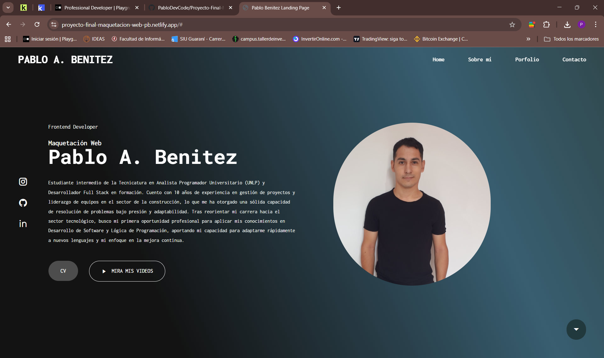

Markdown

# 🚀 Proyecto Final Maquetación Web | Portfolio Personal


> **Landing Page desarrollada como Proyecto Final para el curso de Maquetación Web de Digital House.**

Este proyecto no solo demuestra mis habilidades técnicas en desarrollo Frontend, sino que también sirve como mi **Portfolio Profesional**, narrando mi transición desde la gestión de proyectos en construcción hacia el mundo del desarrollo de software.

## 🌐 Ver Proyecto Online

¡Puedes visitar la web desplegada y funcional aquí! 👇

[](https://proyecto-final-maquetacion-web-pb.netlify.app/)

---

## 📸 Captura de Pantalla


*(Nota: ¡Asegúrate de subir una captura de tu web en la carpeta assets/imgs/ con el nombre preview.png para que se vea aquí!)*

---

## ✨ Características Principales

* **Diseño Totalmente Responsive:** Adaptable a dispositivos móviles (Mobile First), tablets y escritorio utilizando **Media Queries**.
* **Estructura Semántica:** Uso correcto de etiquetas HTML5 (`<header>`, `<main>`, `<section>`, `<footer>`) para mejor SEO y accesibilidad.
* **Estilos Modernos:** Implementación de **Flexbox** para el diseño de layouts y posicionamiento de elementos.
* **Interactividad:** Botones de descarga de CV y enlaces directos a redes sociales y contacto.
* **Optimización de Recursos:** Imágenes y tipografías optimizadas para una carga rápida.

---

## 🛠️ Tecnologías Utilizadas

* **Lenguajes:** HTML5, CSS3.
* **Herramientas de Diseño:** Flexbox, Box Model.
* **Control de Versiones:** Git & GitHub.
* **Despliegue (Deploy):** Netlify (CI/CD integrado).
* **Editor:** VS Code.

---

## 🚀 Instalación y Uso Local

Si deseas clonar este proyecto para verlo en tu máquina local:

1.  **Clonar el repositorio:**
    ```bash
    git clone [https://github.com/PabloDevCode/proyecto-final-maquetacion-web-DH.git](https://github.com/PabloDevCode/proyecto-final-maquetacion-web-DH.git)
    ```
2.  **Entrar a la carpeta:**
    ```bash
    cd proyecto-final-maquetacion-web-DH
    ```
3.  **Abrir en VS Code:**
    ```bash
    code .
    ```
4.  **Ejecutar:**
    Usa la extensión **Live Server** de VS Code para abrir el archivo `index.html`.

---

## 👤 Autor

**Pablo Benítez**
*Analista Programador en Formación | Desarrollador Frontend*

* 💼 [LinkedIn](https://www.linkedin.com/in/devpablobenitez)
* 🐙 [GitHub](https://github.com/PabloDevCode)
* 📧 [Email](devpablobenitez@gmail.com)

---

Developed with 💙 at **Digital House**.
